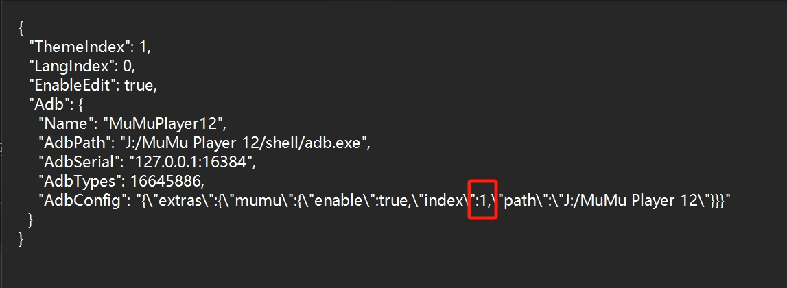
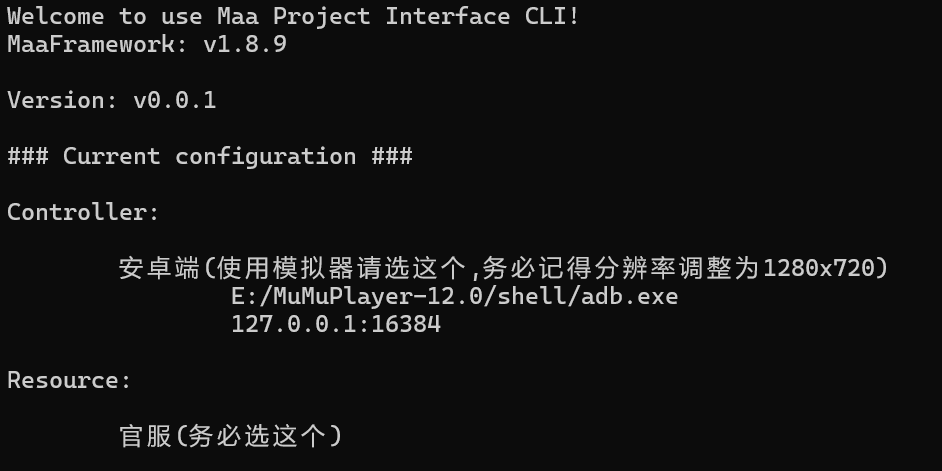
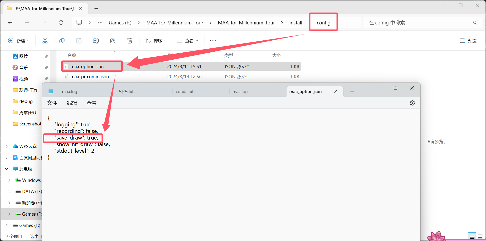

<!-- markdownlint-disable MD033 MD041 -->
# 【**这是什么**】
全称为千年之旅MAA-for-Millennium-Tour，亦可称 千年之旅 律律子小助手 。是一款基于MaaFramework的自动化脚本，适配模拟器运行千年之旅的环境，可以有效解放双手，避免重复性劳作
# 【**支持功能**】
1、自动化日常，包括前半部分日常（自动打开游戏+投色子+关公告+神谕司+商店）与后半部分日常（公会+交日常周常任务+第二次投色子+通行证）  
2、自动化日常战斗，包括选择x2资源关与骚灵之境  
3、自动刷圣别之塔，采用重复放弃的方式多次刷分  
4、自动收取勋章  
5、自动进入温泉点泡泡  
6、自动推进主线战斗关卡，需要先点进自己要打的主线章；目前只支持多关纯战斗自动连战  
# 【**图形化界面**】
### [MFAWPF](https://github.com/SweetSmellFox/MFAWPF)
 由社区大佬[SweetSmellFox](https://github.com/SweetSmellFox)编写的基于WPF的GUI,通过内置的MAAframework来直接控制任务流程
   
 -下载`MMT-win-x86_64-with-GUI-vXXX.zip`
 如果第一次启动后发现找到ADB但是无法执行任务的情况，请尝试将解压目录下config/config.json
 
 中的index改为1后重启程序再尝试  
# 【**使用方法**】
具体教程请看贴吧精华帖[【自动化日常脚本】千年之旅MAA](https://tieba.baidu.com/p/9122503018?pn=1)    
将对应的压缩包解压到文件夹后，双击MFAWPF.exe（如若下载的是图形化界面版本包）或MaaPiCli.exe即可进入**MAA控制终端**    
  
  
注意下载的包的后缀。带有with-gui后缀的包即是接入了图形化界面的包。  
请将模拟器的**分辨率**设置为**1280x720**，并确保开启**root权限**  
初次使用请根据贴吧教程设置好模拟器与Resource资源（即官服），然后根据任务描述添加自己的任务链  
不同任务的要求不同，请务必根据任务后的描述来合理设置任务顺序  
# 【**注意事项**】
1、在更换使用环境后，请再次设置好模拟器与Resource资源，否则可能导致脚本无法正常运行  
2、请不要在模拟器上进行任何操作，例如切换画面等，否则可能导致脚本无法正常读取图像信息，导致无法正常运行    
3、请不要关闭脚本，否则可能导致脚本无法正常运行  
4、MuMu模拟器用户请在模拟器设置的最后一页关闭 **“后台保活”** 功能，否则可能导致脚本无法正常运行  
5、遇到问题后，如若是提示缺失某些运行库或者DLL文件，请先尝试自行搜索该DLL文件棣属于哪个运行库，并安装该运行库  
# 【**协助Debug**】
在开发过程中，每个功能在上传前都会经过实际封包测试，但由于用户的环境以及使用场景与我存在差别，因此对于某些场合我可能并未考虑到，例如神谕司日常部分，有人可能是每天上一次线领奖换人休息，有人可能是上午上一次单单领奖，晚上再换人。不同的情况需要对逻辑链进行相应的优化完善，因此请大家遵循以下的步骤来协助我Debug：  
1、确保模拟器分辨率为1280x720，并开启root权限，关闭了“后台保活”功能    
2、预先查看过上面的精华帖，确保自己没有遇到与帖子里相同的情况或依然无法解决  
3、遇到无法自动检测模拟器的情况，请打开模拟器的安装目录，寻找adb.exe文件，将该文件所在路径手动填入MAA控制终端中选择模拟器时的Manual input的Path（图1），将127.0.0.1:模拟器端口填入Address（图2），然后回车手动添加模拟器  
    
  
  
4、倘若还是无法解决问题，或者模拟器的任务出现了异常中断，请先前往上面的精华帖，**将终端错误截图与此时执行到哪个任务部分、卡在哪里的截图发帖**，然后参考图3，把目录下config文件夹里的maa_config.json右键用记事本打开，把里面save_draw那一行false改成true，之后再次运行maa运行任务，发现任务异常中断且终端上显示某某Task Failed后关闭maa，这个时候在目录下的debug文件夹里会生成对应的识别数据（一个叫vision的文件夹，里面装着全部的图片识别结果）和maa.log。把整个debug文件夹压缩，发到2523559001@qq.com，我在下班后会尽我所能帮忙分析并解决问题。      
  
在一次发送后，将debug文件夹下的vision文件夹删除，以释放空间和防止下一次debug时上一次的图片影响到本次的debug。  
# 【**更新日志**】
详细情况请查看Github的Action部分，以下只记录大更新内容
【】
# 【**特别鸣谢**】
感谢MaaFramework的作者与贡献者们，提供了如此优秀的框架，解答了我的疑惑，让我可以为千年之旅社区做出贡献。
[MaaFramework-基于图像识别的自动化黑盒测试框架](https://github.com/MaaXYZ/MaaFramework)
### 开发者

感谢以下开发者对 千年之旅 律律子小助手 作出的贡献：

  
